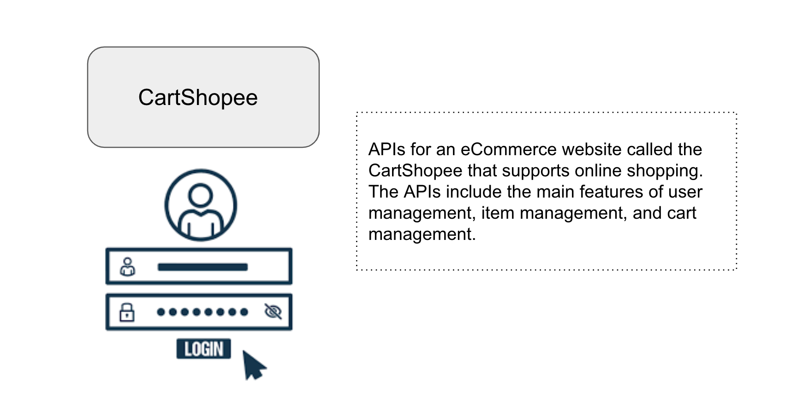
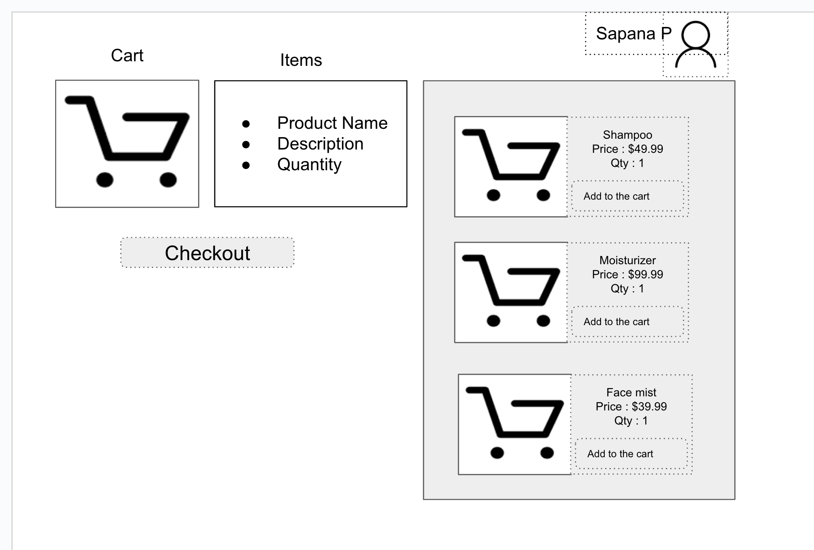
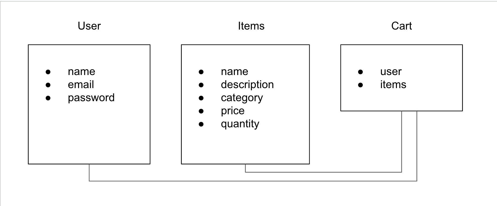

# CartShopee API Project

## Table of Contents

- [Introduction](#introduction)
- [Wireframes](#wireframes)
- [Features](#features)
- [Prerequisites](#prerequisites)
- [Installation](#installation)
- [API Endpoints](#api-endpoints)
- [Testing](#testing)


## Introduction

APIs for an eCommerce website called the CartShopee that supports online shopping. The APIs include the main features of user management, item management, and cart management.

## Wireframes
- Login Page :

 

- Cart Page :



- ERD 



## Features

Main features of the CartShopee project:

- Users Management { create User, User login, User logout, User delete etc. }
- Items Management { create Item(s), List single Item, List All Items, Update Item, delete Item}
- Cart Management  { create Cart, Add Items into the Cart, Remove Items from the Cart, Delete Item(s) from Cart etc. }

## Prerequisites

List of the prerequisites/requirements needed to run the project.

- Node.js
- Express.js
- MongoDB
- JWT (JSON Web Tokens) for authentication
- Nodemon
- Postman
- dependencies
``` 
      "bcrypt": "^5.1.0",
      "dotenv": "^16.3.1",
      "express": "^4.18.2",
      "jsonwebtoken": "^9.0.0",
      "mongoose": "^7.3.1",
      "morgan": "^1.10.0"
```
- devdependencies
```
      "artillery": "^1.7.9",
      "jest": "^29.5.0",
      "mongodb-memory-server": "^8.13.0",
      "supertest": "^6.3.3"
```
## Installation

Step-by-step instructions on how to install the project:

1. Create a new directory in the terminal on your computer.
 ``` 
 mkdir project-2-api 
 ```
2. and then cd into it
 ``` 
 cd project-2-api 
```
3. Go to ```https://github.com/SapnaPalkhade/unit-2-project``` ,and Click on the green ```<> Code``` button.
4. Make sure ```SSH``` is highlighted and copy the code to your clipboard.
5. Go back to your terminal and, navigate to the newly created directory, and clone the repository: 
 ``` 
 git clone git@github.com:SapnaPalkhade/unit-2-project.git 
 ```
6. cd into the `unit-2-project` directory after the project has been cloned.
7. To open the project in VS Code, type `code .` from `unit-2-project`.
7. Run the following command to install the required packages.
```
npm install
``` 
8. Set up the database configuration (MONGO_URI) and SECRET in the `.env` file.
9. Run the command `npm run dev` to start the server ( to start the app without dev mode use `npm start` )
10. Access the application at `http://localhost:3000`.

## API Endpoints

List of the available API endpoints and their descriptions:

- `/users` - Get a list of all users.
	
```
method : post
url : http://localhost:3000/users
body : 
        {
            "name": "sapana",
            "email": "sapana@123.com",
            "password": "password"
        }
authorization : 
```

- `/users/login` - Login into CartShopee by providing email and password.
```
method : post
url : http://localhost:3000/users/login
body : 
        {
   
            "email": "sapana@123.com",
            "password": "password"

        }
authorization : 
```

- `/users/logout` - Route for user to logout from the CartShopee.
```
method : post
url : http://localhost:3000/users/logout
body : 
authorization : required
        type  : bearer token
```

- `/users/<id>` -  Route for deleting a user by ID, with authentication middleware.
```
method : delete
url : http://localhost:3000/users/<id>
body :
authorization : required
        type  : bearer token
```
- `/items/` - Route for creating a new item
```
method : post
url : http://localhost:3000/items
body : 
      {
        "name": "Moisriture-temp",
        "description": "skin-conditoner",
        "category": "skinCare-product",
        "price": 70,
        "quantity": 3
    }
```
- `/items/<itemId>`- Route for retrieving a specific item by ID 
```
method : get
url : http://localhost:3000/items/<itemId>
body : 
```
- `/items/` - Route for retrieving all items
```
method : get
url : http://localhost:3000/items
body : 
```
- `/items/<itemId>` - Route for updating an item by ID
```
method : put
url : http://localhost:3000/items/<itemId>
body : 
    {
        "description": "medicated-body-soap"
    }
```
- `/items/<itemId>` - Route for deleting an item by ID
 ```
method : delete
url : http://localhost:3000/items/<itemId>
body : 
```
-`/cart` - Route for creating a new cart 
```
method : post
url : http://localhost:3000/cart
body : 
authorization : required
        type  : bearer token  
```
- `/cart/<cartId>` - Adding  the item to the perticular cart
```
method : put
url : http://localhost:3000/cart/<cartId>/items
body :  {
        "items": ["64a07c1b25f77538d0959f54","64a07c1b25f77538d0959f52"]
        }
authorization : required
        type  : bearer token  
```
- `/cart/<cartId>` - Show all the items from specific cart (providing cartID)
```
method : get
url : http://localhost:3000/cart/<cartId>/items
body :  
authorization : required
        type  : bearer token  
 ```

- `/cart/<cartId>/items/<itemId>`- Removing the item from the perticular cart (providing cartID and itemID)
```
method : delete
url : http://localhost:3000/cart/<cartId>/items/<itemId>
body : 
authorization : required
        type  : bearer token
```
- `/cart/<cartId>` - showing the total price and quantity for items in a cart
```
method : get
url : http://localhost:3000/cart/<cartId>/total
body : 
```
- `/cart/<id>` - Route for deleting a cart by ID 
```
method : delete
url : http://localhost:3000/cart/<id>
body : 
authorization : required
        type  : bearer token  
```

## Testing

To run the unit tests for the project:

1. Make sure the project dependencies are installed.
2. Run the command `npm run test` to execute the tests.
